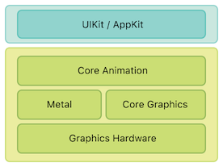
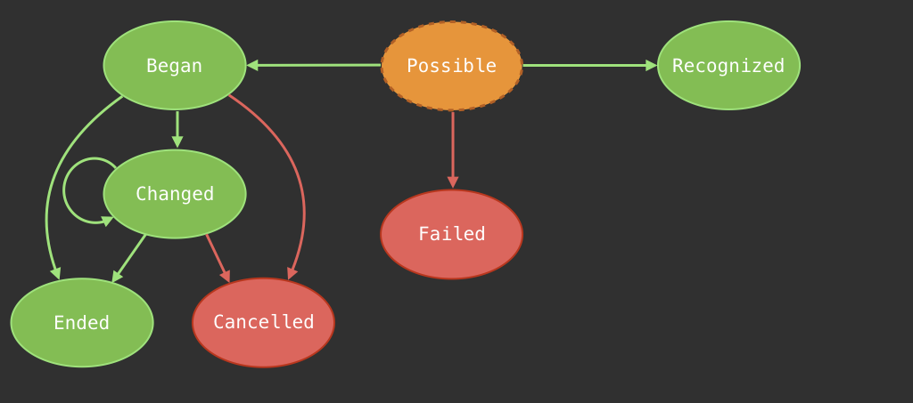

[](https://github.com/iOS-Level-UP-Spring-2021/Home)


[](https://swift.org/)
[](https://ioslevelupspring2021.slack.com/)

---

#### Assignments Results

Assignment results are available [_here_](https://docs.google.com/spreadsheets/d/11tcye_2BSHWbpv12NI0BQ96c5D3Jsg4TG7HpXz2izXY).

Find your data row by hashing your email address using **sha256**. Use an online [tool](http://www.sha1-online.com), or run this bash command:

```sh
printf "email@domain.com" | openssl sha256
```

---

## Classes

### Class 1: UIKit Animations, Gesture Recognition

#### Animations

UIKit animations are simple and easy to master! UIKit is a high level UI Framework, based on Core Animation. Core Animation animations are much more customizable than UIKit's, but UIKit will make it simple to get you started.

[](https://developer.apple.com/library/content/documentation/Cocoa/Conceptual/CoreAnimation_guide/Introduction/Introduction.html)

The simplest animation API looks like this:

```swift
let someView = ... // some view
UIView.animate(withDuration: 0.4) {
  someView.alpha = 0.3
}
```

You can also customize your animation timing functions, and add completion closures like this:

```swift
UIView.animate(withDuration: 0.2, delay: 0, options: [.curveEaseInOut], animations: {
  someView.alpha = 0
}, completion: { completed in
  someView.removeFromSuperview()
})
```

This makes it really easy to chain your animations - just add a new one in the completion closure of the previous one!

There is also a new animation API – `UIViewPropertyAnimator`. It's far more customizable and it's able to handle **interactive** and **interruptible** animations! Both topics are too advanced for this class, but you can learn more [here](https://developer.apple.com/documentation/uikit/uiviewpropertyanimator).

To just use `UIViewPropertyAnimator`, you first create an animator, and then call `startAnimation()` on it.

```swift
let animator = UIViewPropertyAnimator(duration: 0.2, curve: .easeInOut) {
  someView.frame = someView.frame.offsetBy(dx: 100, dy: 0)
}
animator.startAnimation()
```

#### Gestures

Touch detetection on iOS is done using the `UIGestureRecognizer` system. It makes it really simple to handle gesture detection. `UIGestureRecognizer` is an abstract class. To add gesture handling you need three basic steps:

1. Instantiate a concrete Gesture Recognizer (for example `UITapGestureRecognizer`) with a target-action.
2. Optional: configure the gesture
3. Add your gesture to a view.

Gestures on iOS are handled by the gesture system. Each gesture recognizer instance is responsible for recognizing **one** gesture.

There are two types of `UIGestureRecognizer` subclasses. These are discrete and continuous gestures. Each gesture operates using a state machine. Discrete gestures are either recognized or failed (tap, swipe). Continuous gestures begin at some point, and take a while to complete (for example a pan – user starts panning, continues for a while, and then lifts off their finger). Each gesture state machine looks as following:



All gestures start in the state `possible`, and then move either to `failed` or `recognized` (discrete gestures) and `began` (for continuous gestures). It's a race – whichever recognizer recognizes **first** gets to handle the gesture until it's finished. You can override this behaviour for raw gesture handling using methods like `delaysTouchesBegan` for mixing with raw touch handling, or gesture recognizer delegates for interactions between gestures.

You can also subclass `UIGestureRecognizer` and use its API to create your own gestures. You just have to follow this state machine graph, as well as follow the rule *fail as quickly as possible* (which all gestures should do), and you'll get your own gesture recognizer which just works great with the whole gesture system.

See more [here](https://developer.apple.com/documentation/uikit/uigesturerecognizer).

### Class 2: Testing on iOS

#### Basics

Unit test is a failsafe to make sure that your app **behaviour** is preserved. Unit Tests should evaluate the smallest possible functionality **in isolation** from other code.

#### Unit Test lifecycle

* **Arrange** - setup your subject (SUT)
* **Act** - call the method under test
* **Assert** - compare your results with expectations

#### When a test **isn't** a Unit Tests

* It talks to the database
* It communicates over the network
* It touches the file system

#### TDD process - `Red -> Green -> Refactor`

* **Red**
  * Think for a while – what piece of code could move your current task towards completion?
  * Write a short test:
    * Tested object might not exist
    * Method might not be implemented
  * Execute your test, making sure that it fails
* **Green**
  * Write production code in your project:
    * Your previous tests have to pass
    * Do not focus on code quality
    * You can hardcode whatever you want to achieve the passing test
  * Execute your tests, check the results
  * You have a proof that the test is testing the right thing
* **Refactor**
  * Relax 💆‍♂️ All your tests are passing ✅
  * Go back to the code you’ve just written. See what could be improved
  * Don’t be afraid to change your code. Tests will quickly catch mistakes
  * Remove any code duplication (DRY) and code smells
  * No idea how to improve? Leave it as is for a while!

#### How to create unit tests in XCode?

* `⌘ + U` is your best friend
* Subclass `XCTestCase`
* All methods that start with `test` and take no parameters and return `Void` become Unit Tests
* Run all your tests with `⌘ + U`

```swift
import XCTest

class ExampleTests: XCTestCase {

  func testCompilerSanity() {
    XCTAssertEqual(true, true)
  }

}
```

* Use `setUp` / `tearDown` to run code before and after *each* test

```swift
import XCTest
@testable import MyApp

class AppDelegateTests: XCTestCase {

  var sut: AppDelegate!

  override func setUp() {
    super.setUp()
    sut = AppDelegate()
  }

  override func tearDown() {
    sut = nil
    super.tearDown()
  }

  func testAppDelegateDoesNotHaveAWindowByDefault() {
    XCTAssertNil(sut.window)
  }

  func testAppDelegateHasAWindowAfterAppLaunches() {
    _ = sut.application(UIApplication.shared,
 didFinishLaunchingWithOptions: [:])
    XCTAssertNotNil(sut.window)
  }

  func testWindowShouldHaveViewControllerAfterLaunching() {
    _ = sut.application(UIApplication.shared,
 didFinishLaunchingWithOptions: [:])
    XCTAssertTrue(sut.window?.rootViewController is MyViewController)
  }
}
```

#### Test Doubles

Tests should be executed **in isolation**. Therefore we use **Test Doubles** in almost every scenario. Please take a look at the Joker project (which is a part of your home assignment). Play around with it – it's fully tested.

There are some test doubles that you'll have to use. Test doubles let you isolate your object and perform interaction tests.

---

## Resources

- [Install Swift on Linux](https://swift.org/download/#releases) - we're using version `5.3`
- [Open Source Swift](https://swift.org)
- [Free Swift Book](https://itunes.apple.com/us/book/the-swift-programming-language/id881256329?mt=11)
- [iOS Documentation](https://developer.apple.com/documentation/)
- [Apple Development Videos](https://developer.apple.com/videos/)
- [Git collaboration](https://www.atlassian.com/git/tutorials/comparing-workflows)

## Contact

- [Slack](https://ioslevelupspring2021.slack.com/)
- [E-mail](mailto:ios@daftacademy.pl)
- [Twitter](https://twitter.com/mdab121)
