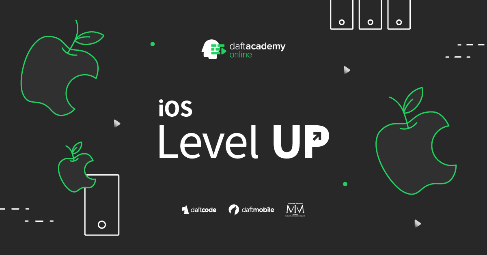
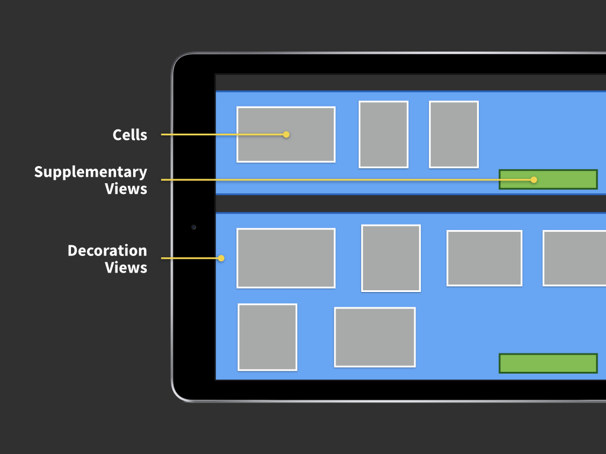
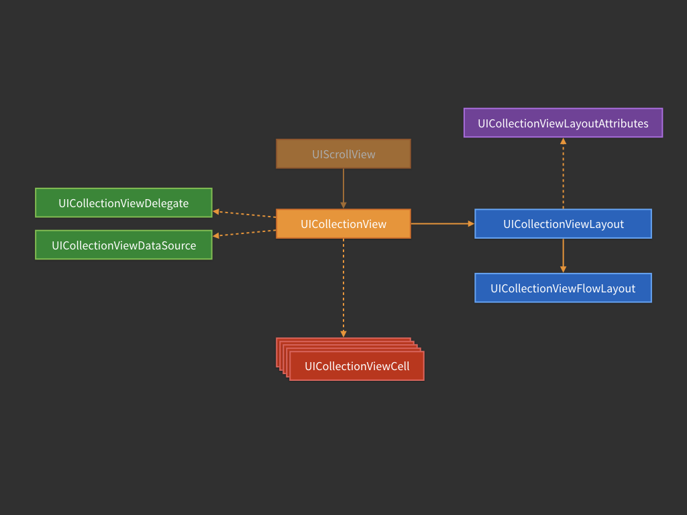

[](https://github.com/iOS-Level-UP-Spring-2021/Home)


[](https://swift.org/)
[](https://ioslevelupspring2021.slack.com/)

---

#### Assignments Results

Assignment results are available [_here_](https://docs.google.com/spreadsheets/d/11tcye_2BSHWbpv12NI0BQ96c5D3Jsg4TG7HpXz2izXY).

Find your data row by hashing your email address using **sha256**. Use an online [tool](http://www.sha1-online.com), or run this bash command:

```sh
printf "email@domain.com" | openssl sha256
```

---

## Classes

### Class 1: UIKit Animations, Gesture Recognition

#### Animations

UIKit animations are simple and easy to master! UIKit is a high level UI Framework, based on Core Animation. Core Animation animations are much more customizable than UIKit's, but UIKit will make it simple to get you started.

[](https://developer.apple.com/library/content/documentation/Cocoa/Conceptual/CoreAnimation_guide/Introduction/Introduction.html)

The simplest animation API looks like this:

```swift
let someView = ... // some view
UIView.animate(withDuration: 0.4) {
  someView.alpha = 0.3
}
```

You can also customize your animation timing functions, and add completion closures like this:

```swift
UIView.animate(withDuration: 0.2, delay: 0, options: [.curveEaseInOut], animations: {
  someView.alpha = 0
}, completion: { completed in
  someView.removeFromSuperview()
})
```

This makes it really easy to chain your animations - just add a new one in the completion closure of the previous one!

There is also a new animation API – `UIViewPropertyAnimator`. It's far more customizable and it's able to handle **interactive** and **interruptible** animations! Both topics are too advanced for this class, but you can learn more [here](https://developer.apple.com/documentation/uikit/uiviewpropertyanimator).

To just use `UIViewPropertyAnimator`, you first create an animator, and then call `startAnimation()` on it.

```swift
let animator = UIViewPropertyAnimator(duration: 0.2, curve: .easeInOut) {
  someView.frame = someView.frame.offsetBy(dx: 100, dy: 0)
}
animator.startAnimation()
```

#### Gestures

Touch detetection on iOS is done using the `UIGestureRecognizer` system. It makes it really simple to handle gesture detection. `UIGestureRecognizer` is an abstract class. To add gesture handling you need three basic steps:

1. Instantiate a concrete Gesture Recognizer (for example `UITapGestureRecognizer`) with a target-action.
2. Optional: configure the gesture
3. Add your gesture to a view.

Gestures on iOS are handled by the gesture system. Each gesture recognizer instance is responsible for recognizing **one** gesture.

There are two types of `UIGestureRecognizer` subclasses. These are discrete and continuous gestures. Each gesture operates using a state machine. Discrete gestures are either recognized or failed (tap, swipe). Continuous gestures begin at some point, and take a while to complete (for example a pan – user starts panning, continues for a while, and then lifts off their finger). Each gesture state machine looks as following:


All gestures start in the state `possible`, and then move either to `failed` or `recognized` (discrete gestures) and `began` (for continuous gestures). It's a race – whichever recognizer recognizes **first** gets to handle the gesture until it's finished. You can override this behaviour for raw gesture handling using methods like `delaysTouchesBegan` for mixing with raw touch handling, or gesture recognizer delegates for interactions between gestures.

You can also subclass `UIGestureRecognizer` and use its API to create your own gestures. You just have to follow this state machine graph, as well as follow the rule *fail as quickly as possible* (which all gestures should do), and you'll get your own gesture recognizer which just works great with the whole gesture system.

See more [here](https://developer.apple.com/documentation/uikit/uigesturerecognizer).

### Class 2: Testing on iOS

#### Basics

Unit test is a failsafe to make sure that your app **behaviour** is preserved. Unit Tests should evaluate the smallest possible functionality **in isolation** from other code.

#### Unit Test lifecycle

* **Arrange** - setup your subject (SUT)
* **Act** - call the method under test
* **Assert** - compare your results with expectations

#### When a test **isn't** a Unit Tests

* It talks to the database
* It communicates over the network
* It touches the file system

#### TDD process - `Red -> Green -> Refactor`

* **Red**
  * Think for a while – what piece of code could move your current task towards completion?
  * Write a short test:
    * Tested object might not exist
    * Method might not be implemented
  * Execute your test, making sure that it fails
* **Green**
  * Write production code in your project:
    * Your previous tests have to pass
    * Do not focus on code quality
    * You can hardcode whatever you want to achieve the passing test
  * Execute your tests, check the results
  * You have a proof that the test is testing the right thing
* **Refactor**
  * Relax 💆‍♂️ All your tests are passing ✅
  * Go back to the code you’ve just written. See what could be improved
  * Don’t be afraid to change your code. Tests will quickly catch mistakes
  * Remove any code duplication (DRY) and code smells
  * No idea how to improve? Leave it as is for a while!

#### How to create unit tests in XCode?

* `⌘ + U` is your best friend
* Subclass `XCTestCase`
* All methods that start with `test` and take no parameters and return `Void` become Unit Tests
* Run all your tests with `⌘ + U`

```swift
import XCTest

class ExampleTests: XCTestCase {


  func testCompilerSanity() {
    XCTAssertEqual(true, true)
  }

}
```

* Use `setUp` / `tearDown` to run code before and after *each* test

```swift
import XCTest
@testable import MyApp

class AppDelegateTests: XCTestCase {

  var sut: AppDelegate!

  override func setUp() {
    super.setUp()
    sut = AppDelegate()
  }

  override func tearDown() {
    sut = nil
    super.tearDown()
  }

  func testAppDelegateDoesNotHaveAWindowByDefault() {
    XCTAssertNil(sut.window)
  }

  func testAppDelegateHasAWindowAfterAppLaunches() {
    _ = sut.application(UIApplication.shared,
 didFinishLaunchingWithOptions: [:])
    XCTAssertNotNil(sut.window)
  }

  func testWindowShouldHaveViewControllerAfterLaunching() {
    _ = sut.application(UIApplication.shared,
 didFinishLaunchingWithOptions: [:])
    XCTAssertTrue(sut.window?.rootViewController is MyViewController)
  }
}
```

#### Test Doubles

Tests should be executed **in isolation**. Therefore we use **Test Doubles** in almost every scenario. Please take a look at the Joker project (which is a part of your home assignment). Play around with it – it's fully tested.

There are some test doubles that you'll have to use. Test doubles let you isolate your object and perform interaction tests.

---

### Class 3: Collection View and its Layout

#### Basics

We've talked (as the class name suggests) about `UICollectionView`. `UICollectionView` was introduced back in iOS 6 as an addition to `UITableView` for displaying collections of data on screen. Collection is not a replacement for a table – you can still use table views, however `UICollectioView` is far more generic and customizable.

#### Hierarchies

There are three sort of view categories that you can put in a Collection View. Those are:

1. Cells – which are obviously data driven. They are the data that you display (could be anything: labels, photos, views...)

2. Supplementary Views - those are data driven as well. They represent sort of a metadata to your cells. In Table View those would be your header and footer views, but here the concept of supplemetary view is far more generic, so they've picked this name instead

3. Decoration Views – those are the decorations. Backgrouds, grids, etc. Everythig that is not strictly data driven – decoration views are layout driven, so they are not configured in Collection View's data source.

Here you have a typical collection view layout and its view hierarchy:



#### Providing data

There's the same datasource-based mechanism of providing data to `UICollectioView` as in table view. You set up a data source, and the collection view asks its data source for cell configuration (you use the same cell dequeue mechanism as well).

#### Architecture



There are more components to a `UICollectionView` than to a `UITableView` since the collection view is **far** more generic and customizable. The main difference is the **LAYOUT** object. The layout is responsible for positioning the views inside `UICollectionView`'s content size (and to be more exact: it's responsible for calculating their *layout attributes* which the collection view later applies).

##### UICollectionViewLayout

The layout object is the most important object that you'll customize to get a custom collection view. It's designed to be sublassable and generic. There are just a few methods that you need to implement to get your collection view a custom layout. But firstly, let's talk about layouts that are provided with `UIKit`.

There's only one layout that is provided out of the box, and it's called `UICollectionViewFlowLayout`. It's also a very customizable and subclassable layout that is designed to be a single scrolling direction, line breaking layout. There's a ton of information online that you can get about flow layout, so I won't get into much detail here (as always, start with the [documentation](https://developer.apple.com/documentation/uikit/uicollectionviewflowlayout)). Generaly speaking, you almost *never* need anything more thatn a flow layout (or a simple subclass).


To subclass a layout (either basic, abstract collection view layout, or flow layout) you need to implement these methods:

- `var collectionViewContentSize: CGSize { get }` – pretty self explainatory – you need to calculate how big your collection view is going to be.

- `func layoutAttributesForElements(in rect: CGRect) -> [UICollectionViewLayoutAttributes]?` - here you compute the layout attributes (frame, size, alpha, zIndex, etc... + your custom properties) for any element that should be visible in a given rect.

- `func layoutAttributesForItem(at indexPath: IndexPath) -> UICollectionViewLayoutAttributes?` - same as above, but based on an index path, not on a rect.

See more about subclassing [here](https://developer.apple.com/documentation/uikit/uicollectionviewlayout).

##### UICollectionViewLayoutAttributes

This object is the layout attributes that are computed by the layout, for the collection view. Those *objects* are also subclassable – you can add a custom layout property and pass them throught your subclass of `UICollectionViewLayoutAttributes` to your items (like background color for example). Each time you subclass `UICollectionViewLayoutAttributes` remember to override `copy()` and `isEqual` with a valid implementation since they're heavily used by the system.

The layout attributes are computed by the layout and passed to a collection view, and then applied to items in `func apply(_ layoutAttributes: UICollectionViewLayoutAttributes)`. You can override this method to apply your custom attributes.

---

## Resources

- [Install Swift on Linux](https://swift.org/download/#releases) - we're using version `5.3`
- [Open Source Swift](https://swift.org)
- [Free Swift Book](https://itunes.apple.com/us/book/the-swift-programming-language/id881256329?mt=11)
- [iOS Documentation](https://developer.apple.com/documentation/)
- [Apple Development Videos](https://developer.apple.com/videos/)
- [Git collaboration](https://www.atlassian.com/git/tutorials/comparing-workflows)

## Contact

- [Slack](https://ioslevelupspring2021.slack.com/)
- [E-mail](mailto:ios@daftacademy.pl)
- [Twitter](https://twitter.com/mdab121)
